# Fitting a proliferation model with complex mixture

## Introduction

This vignette accompanies the ProliferationAnalysis package, to run semi automated proliferation models in a high throughput manner. It has options to deconvolute the effect of complex mixtures of cells where a stain negative population is present in the sample. These stain negative cells can unduly influence proliferation statistics.

IMPORTANT NOTE: This is NOT a guide to best practices to performing a proliferation experiment and assumes some basic knowledge on getting a FACS proliferation trace ready and evaluating its quality. This does NOT cover how to setup gates etc.

```r
library(ProliferationAnalysis)
data("ctv_example")
```

### Example data

The package comes bundled with some example traces.

#### Sample with no mixture (sample.a)

```r
sample.a <- ctv[[10]]

plot(density(log10(sample.a)),
     type="l")
```

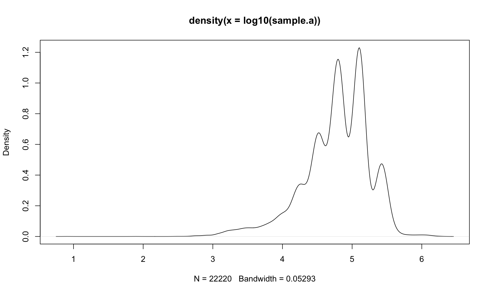

#### Sample with high mixture (sample.b)

```r
sample.b <- ctv[[28]]

plot(density(log10(sample.b)),
     type="l")
```

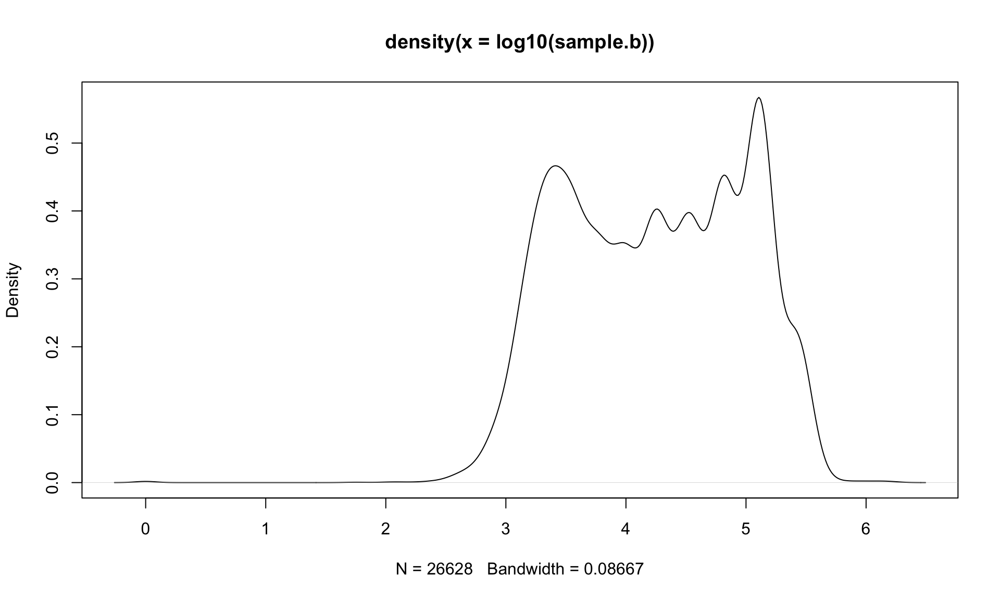

## Fitting a proliferation model to CTV traces

The first step before we run proliferation modeling is to extract the raw per-cell CTV (other dyes are available) intensities from the .fcs files and gate on single cells *. Depending on your goals, you can then proceed in two ways.

1. If you have no mixture of cells I would recommend gating on the CTV+ population to avoid debris and CTV- cells affecting the fit. Then proceed with example 1.
2. If you have a complex cell sample where only a portion of cells have been stained, proceed with example 2.

\* This package does NOT handle this part, and would refer you to the plethora of FACS analysis options available in R. I quite like CytoExploreR for gating.

### Example one

#### Step 0: Choose your optimizer

The package offers two optimization schemes.

1. [recommended] Non linear least squares (LS) with `mode="LS"`. Here the data is first binned and smoothed, then parameters are optimized over the smoothed trace using non linear least squares. This method is quick and robust, but relies on binning and some other data processing so is technically less accurate.
2. Maximum likelihood estimation (MLE) based with `mode="MLE"`. This mode is a little more proper in that it does not rely on binning or other data tricks to optimize, and takes the full data set to optimize on directly. Initial parameter estimation is still done on a binned smoothed version of the data, but optimization is not. The disadvantage is it a lot slower to run, and hence I would not recommend it. On the todo list is to speed this up, but given the least squares works very well, this is not a high priority.

In practice I have found very little difference between these two when the setup is performed correctly. Some examples below of issues you may encounter.

#### Step 1: Identify gen0

First, Identify the rough cutoff where the undivided generation is. This cutoff needs to be left of the mode of gen 0. I recommend putting it into the valley after the first mode. This can be set in a consistent way for your samples using a CytoExploreR gate by your negative control sample. In this case we will be setting it manually.

Note this does not directly affect the fit, and is just used to find the mode of gen0 in each sample.

```r
gen0.cutoff <- 5.3

plot(density(log10(sample.a)), type="l")
abline(v=gen0.cutoff, lty=2)
```

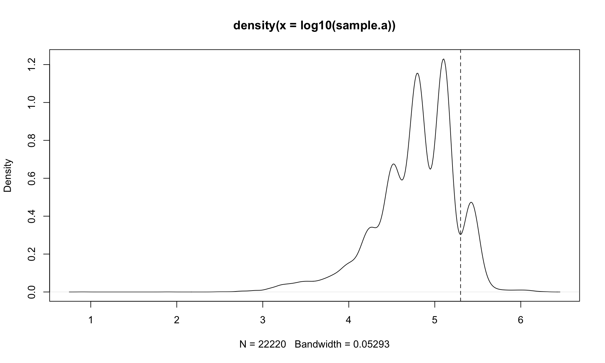

#### Step 2: fit peaks

In the simplest case we can run `fit_peaks`, which estimates peak numbers automatically. We will look later on at performing and tweaking a fit step by step.

```r
# Basic fit
fit <- fit_peaks(trace=sample.a,
                 peak.0.lower.bound=gen0.cutoff,
                 mode="LS")
```


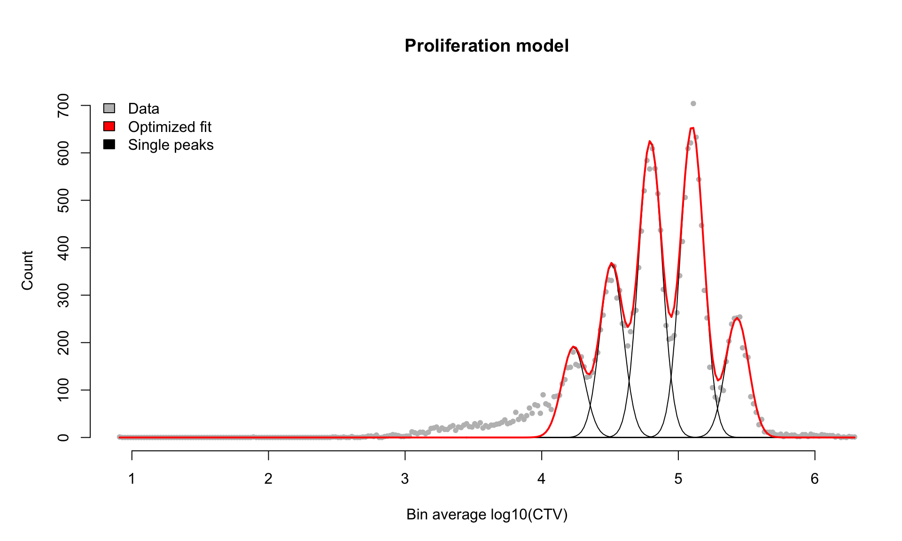

The first plot shows where the initial peak estimates are located, and how many peaks will be optimized over. The red line indicates the mode of peak 0 the grey dotted line the lower cutoff we set in the gen0.cutoff variable and the grey lines the modes of subsequent peaks. The next plots show the output of the optimization and how the initial parameters have changed during fitting.

This can be useful to diagnose issues if you get weird looking fits.

The final single plot shows the original trace vs the optimized model.

#### Step 3: Evaluate and diagnose issues

If we now run a different sample, we can see there is an issue

```r
# Basic fit with default parameters goes wrong
fit <- fit_peaks(trace= ctv[[14]],
                 peak.0.lower.bound=gen0.cutoff,
                 mode="LS")
```

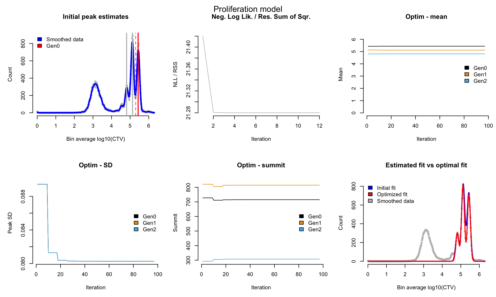
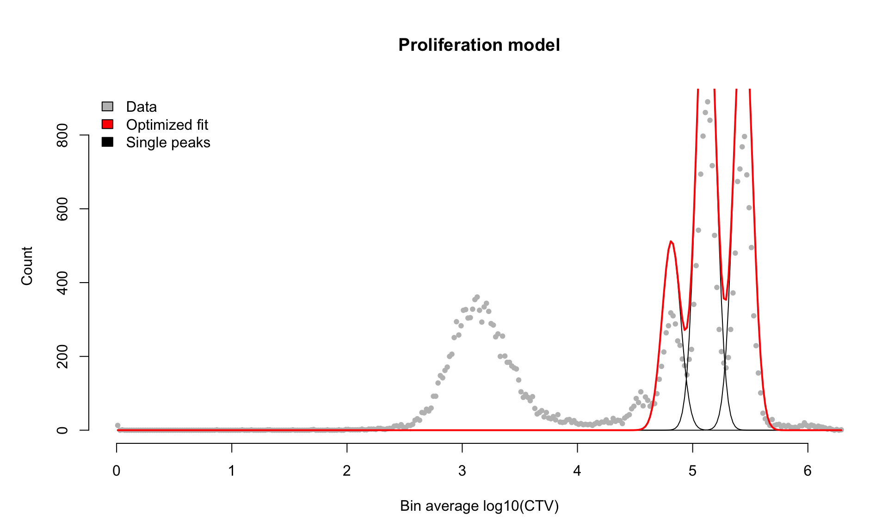

In this case the left tail in the data is causing the optimizer to spread out the distribution within its constraints as much as possible.

This is clearly wrong and has as a cause that the automated peak estimates don't cover this tail. In this case, there is also an extra little peak we are missing that does not pass the default peak thresholds, which is making the issue worse.

However, we can easily solve this in a couple of ways

##### Option 1: Trimming the optimizer region

Enable the "auto gating" by trimming left and right tails that fall outside of the initial model range. The initial peak estimates are first made on the full trace that is supplied. Then the values within one peak sd outside are removed in `mode="MLE"` or bins set to zero count in `mode="LS"`. This prevents the optimizer from fitting to the tails. The only sacrifice here is a small loss in accuracy and potentially an issue if the initial parameter estimates are way off, so carefully check its working as intended.

```r
fit <- fit_peaks(trace=ctv[[14]],
                 peak.0.lower.bound=gen0.cutoff,
                 opt.trim.left.tail = T,
                 opt.trim.right.tail = T)
```

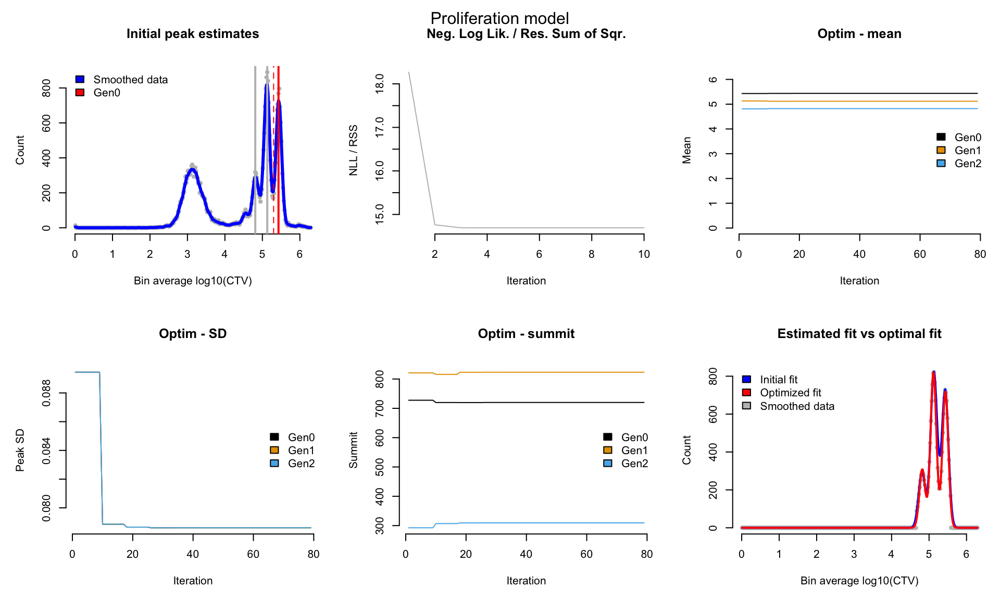
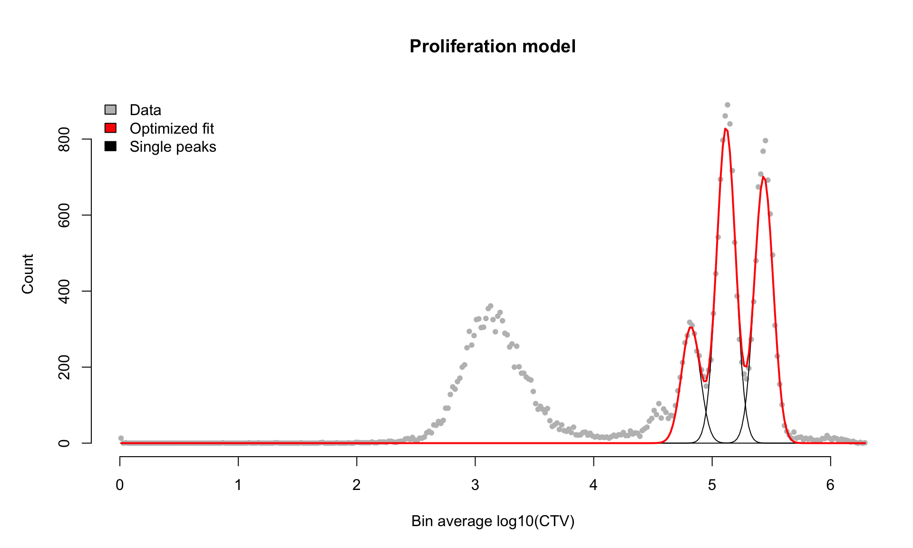

We can control the trimming of the tail using the options `opt.trim.right.tail` and `opt.trim.left.tail`.

In this case it makes little difference due to the way parameter constraints are setup. But this can be sample specific!

In the following example, we first forcibly misspecify the model to show how trimming the left tail outside of the initial estimates influences the optimizer.

```r
par(mfrow=c(2,1))
fit <- fit_peaks(trace=sample.a,
                 peak.0.lower.bound=gen0.cutoff,
                 peak.thresh.enrich=0,
                 peak.thresh.summit=0,
                 peak.max=2,
                 opt.trim.left.tail=F,
                 plot.optim=F)

fit <- fit_peaks(trace=sample.a,
                 peak.0.lower.bound=gen0.cutoff,
                 peak.thresh.enrich=0,
                 peak.thresh.summit=0,
                 peak.max=2,
                 opt.trim.left.tail=T,
                 plot.optim=F)
```

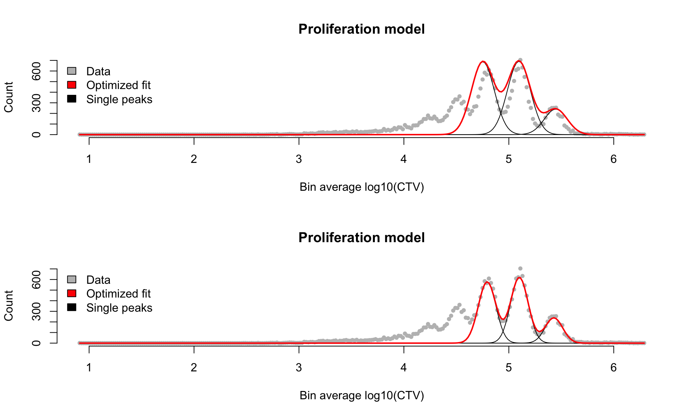

```r
par(mfrow=c(1,1))
```

##### Option 2: Strictly gate the CTV+ region

Fix the fit by strictly gating out the CTV- and CTV++ tails prior to running.

This is a simple solution but keep in mind that it might not be the most accurate as with the "auto gating". The advantage over option 1 is that here the initial peak estimates are also limited to this range.

In practice this is well within reasonable limits to do, as you would also do this in common software such as FlowJo or FCS express. This gating can easily be performed on all your samples in CytoExploreR or other FCS analysis packages.

```r
fit <- fit_peaks(trace=ctv[[14]][log10(ctv[[14]]) > 4 & log10(ctv[[14]]) < 5.6],
                 peak.0.lower.bound=gen0.cutoff)
```

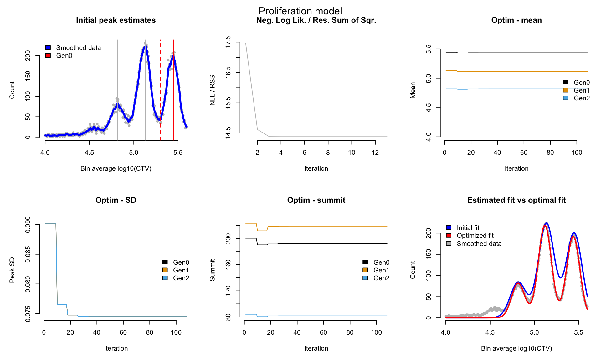
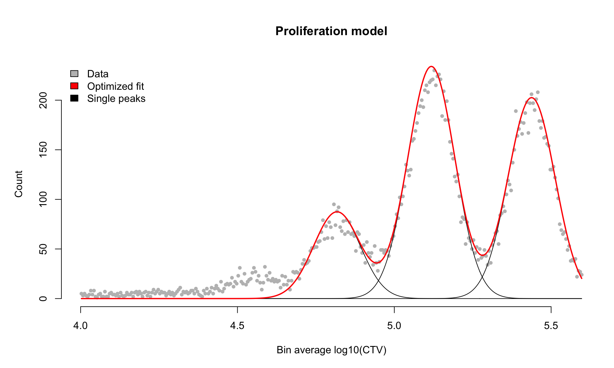

##### Option 3: Tweak the initial peak calling

You can allow more peaks to be fit in the model by relaxing initial estimation thresholds. This can be achieved by tweaking `peak.thresh.enrich`, `peak.thresh.summit` and `peak.max`. To not filter any possible peaks, set these to 0.

The disadvantage here is that you might include many more peaks, increasing model complexity, and which are not likely to be very accurate as in lower ranges the proliferation traces are less reliable.

```r
fit <- fit_peaks(trace=ctv[[14]],
                 peak.0.lower.bound=gen0.cutoff,
                 peak.thresh.enrich=0,
                 peak.thresh.summit=0,
                 opt.trim.right.tail=T)
```

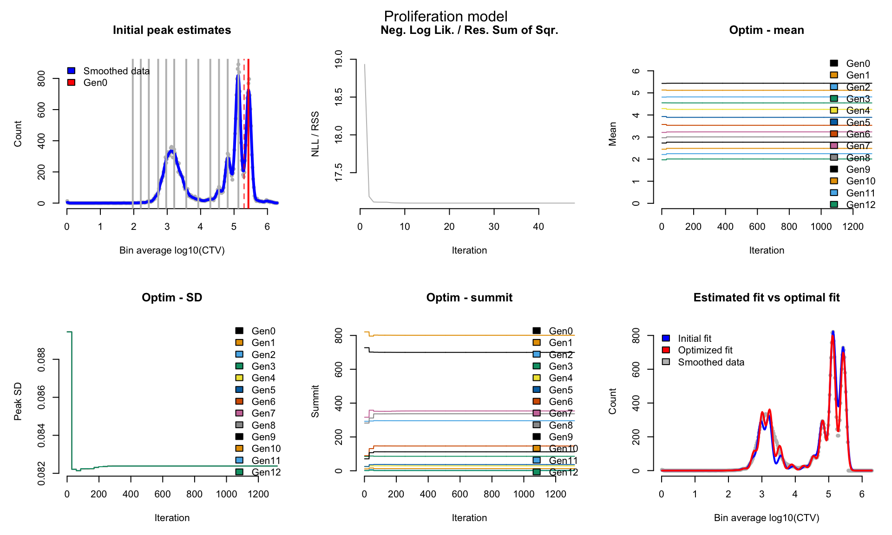
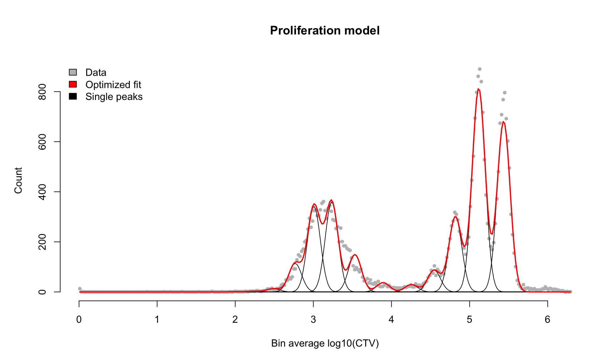

As you can see, this produces a nonsensical model as well, as we have a very clear and distinct CTV- sample in this data. If we set `peak.max` and the thresholds to 0 we can force only 3 peaks, or we can relax the thresholds so more peaks are considered.

```r
# Force a model with 3 peaks
fit <- fit_peaks(trace=ctv[[14]],
                 peak.0.lower.bound=gen0.cutoff,
                 peak.thresh.enrich=0,
                 peak.thresh.summit=0,
                 peak.max=3,
                 plot.optim = F)
```

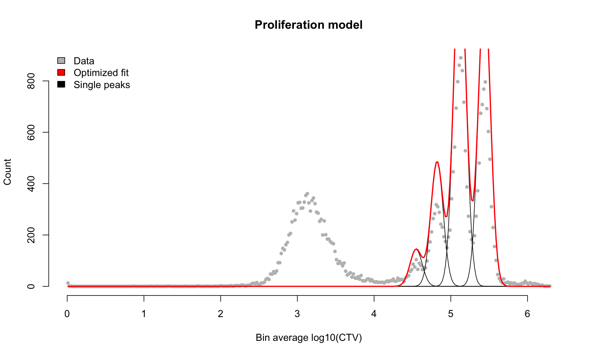

```r
# Relax the auto detect peak thresholds
fit <- fit_peaks(trace=ctv[[14]],
                 peak.0.lower.bound=gen0.cutoff,
                 peak.thresh.enrich=0,
                 peak.thresh.summit=0.01,
                 opt.trim.right.tail=T,
                 plot.optim = F)
```

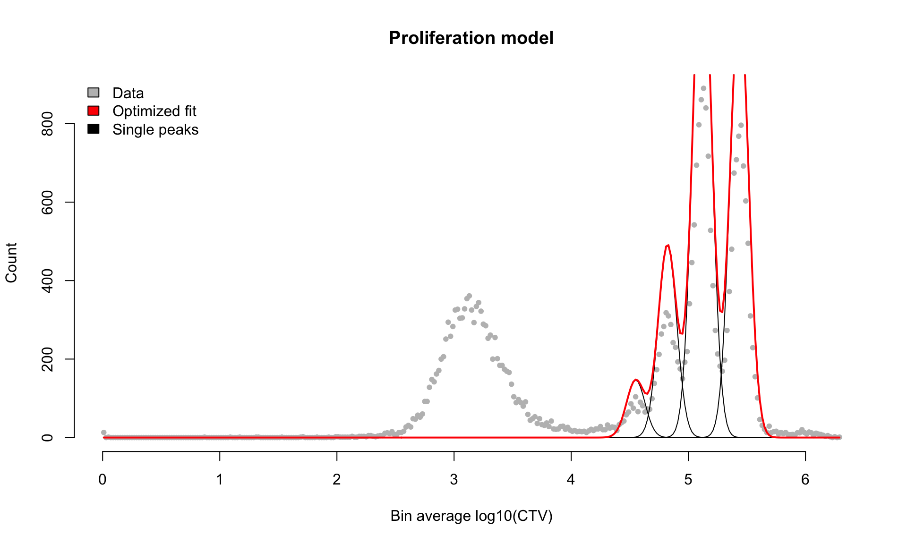

But the result is still not quite right! We note that this is generally a rare case for modeling peaks and should only occur if the sample was taken from a mixed cell culture. To fully fix this more complex sample, you can then either, supply `opt.trim.left.tail=T` with the fixed peak number or model the CTV- peak directly by supplying `peak.x.model = T`.

```r
# Use a fixed amount of peaks
fit <- fit_peaks(trace=ctv[[14]],
                 peak.0.lower.bound=gen0.cutoff,
                 peak.thresh.enrich=0,
                 peak.thresh.summit=0.01,
                 opt.trim.left.tail=T,
                 opt.trim.right.tail=T,
                 plot.optim = F)
```

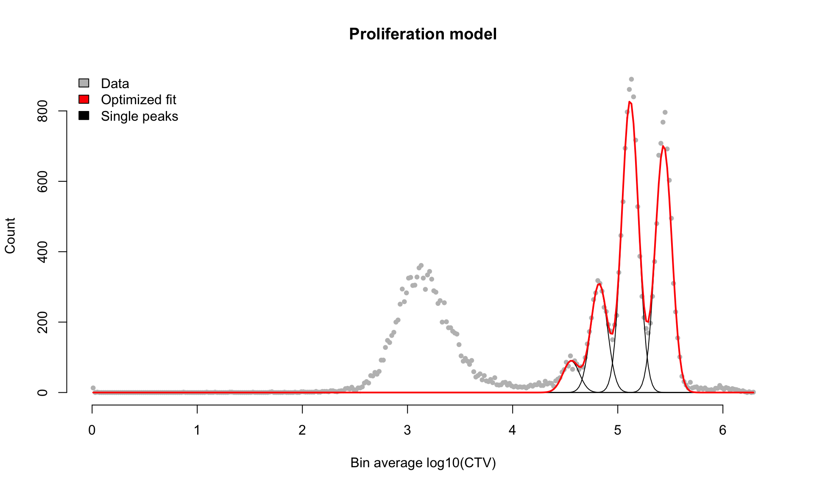

```r
# Explicitly model a ctv- generation
fit <- fit_peaks(trace=ctv[[14]],
                 peak.0.lower.bound=gen0.cutoff,
                 peak.thresh.summit=0.01,
                 peak.x.model=T,
                 plot.optim = F)
```

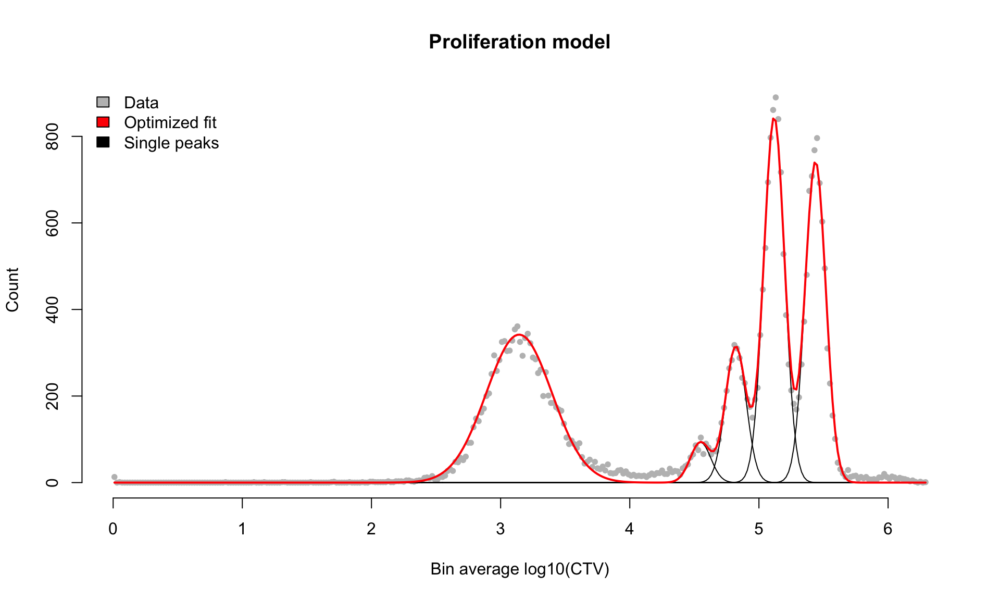

If we now run the same parameters using MLE we will see we will find a similar model. It just might take a little while to run

```r
fit <- fit_peaks(trace=ctv[[14]],
                 peak.0.lower.bound=gen0.cutoff,
                 mode="MLE",
                 peak.thresh.enrich=0,
                 peak.thresh.summit=0.01,
                 opt.trim.left.tail=T,
                 opt.trim.right.tail=T,
                 plot.optim=T,
)
```

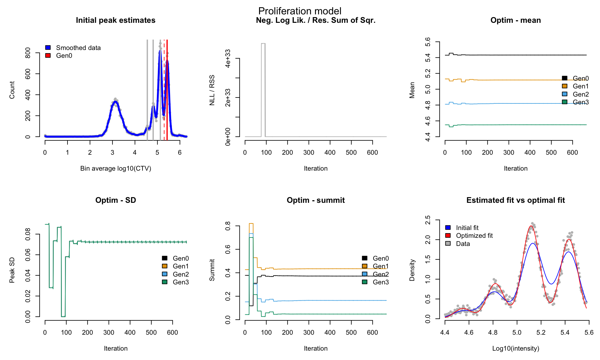
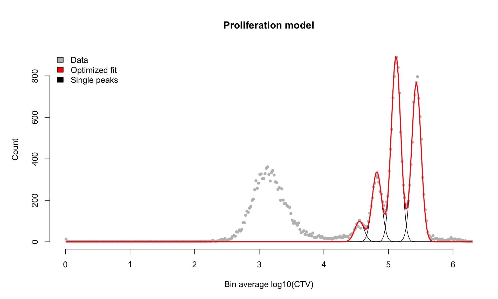

### Example Two: Modelling an extra generation

Please read example one first before moving on to this as many of the principles are shared.

We can also choose to model an additional parameter, capturing a CTV- generation. This additional peak is unconstrained on SD and position, which can give issues. I'd recommend constraining the peak to be outside the CTV- gate set manually. This only really is an issue when the CTV- population is very small, if there is a clear peak, the autodetection works well.

By specifying `peak.x.model` a special generation is added to the model which has its own standard deviation and position. This is free from the constraints set by the proliferation model. This is useful if the trace has been done on a mixture of stained and unstained cells, which might bleed over into each other.

This will yield proper estimates of cell counts in later peaks where there is bleedover, whereas gating will over-estimate cell counts.

```r
# In this case autodetection fails, as there is no clear CTV- peak, and we have not setup a constraint on where it can be
fit <- fit_peaks(trace=sample.a,
                 peak.0.lower.bound=gen0.cutoff,
                 mode="LS",
                 opt.trim.right.tail=F,
                 peak.x.model = T,
                 plot.optim=T
)
```

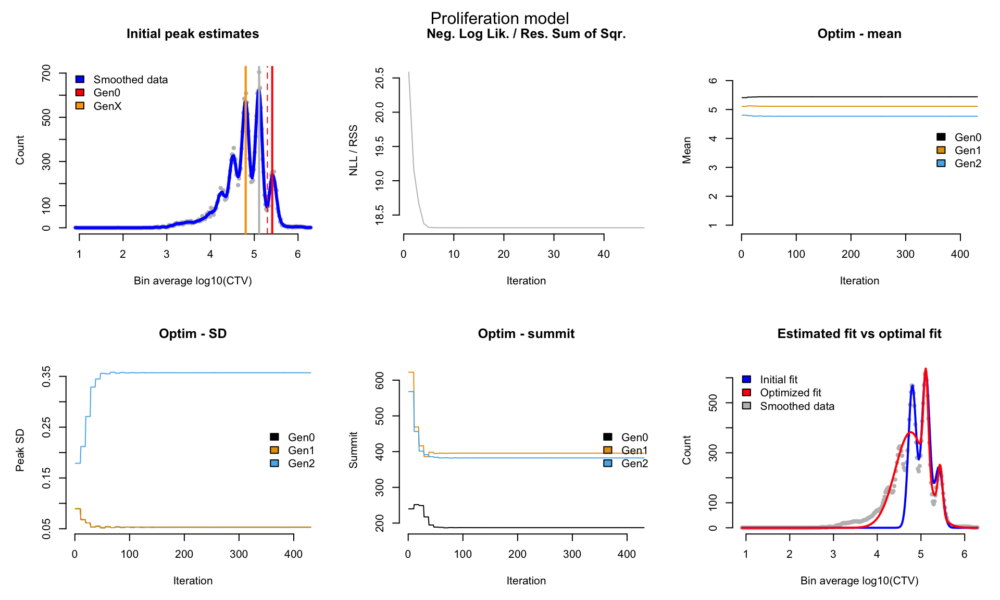
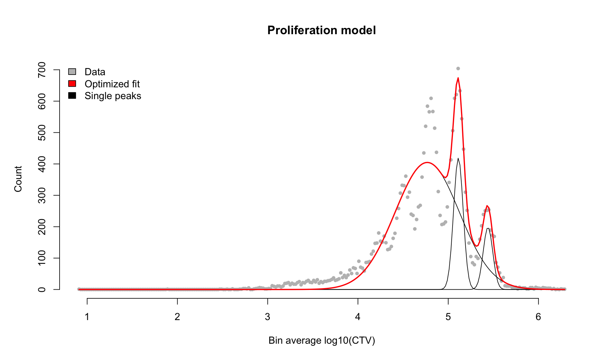

```r
# With a bound on where the peak mean can be, in this case, there is just a spread, and no peak.x is explicitly modelled
fit <- fit_peaks(trace=sample.a,
                 peak.0.lower.bound=gen0.cutoff,
                 mode="LS",
                 opt.trim.right.tail=F,
                 peak.x.model = T,
                 peak.x.thresh.summit = 0.01,
                 peak.x.upper.bound = 3.5,
                 plot.optim=T,
)
#> Warning: No peak found at specified thresholds. Returning the mode witin hard
#> limit set by peak.x.upper.bound
#> Warning in fit_peaks(trace = sample.a, peak.0.lower.bound = gen0.cutoff, : No
#> valid mode for peak.x found, skipping fitting. Adjust parameters if it should
#> be there.
```

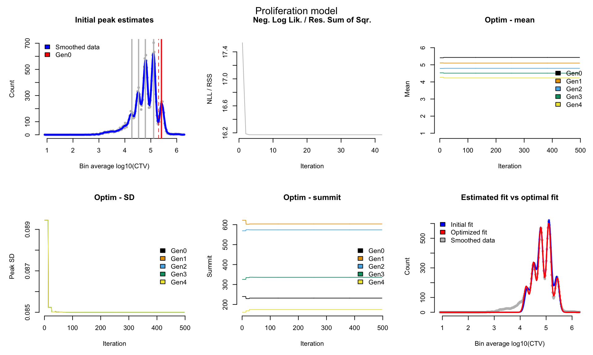


In some samples the cells may have proliferated so much that there is a bleedover between divided cells and CTV- cells, or the CTV- cells have bleedover because of autofluorescence. The package can pull this apart by assuming a Gaussian density of the CTV- population.

```r
# Fit sample accounting for bleedover
fit.a <- fit_peaks(trace=sample.b,
                   peak.0.lower.bound=gen0.cutoff,
                   mode="LS",
                   opt.trim.left.tail = F,
                   opt.trim.right.tail = T,
                   peak.x.model = T,
                   plot.optim=F)
```

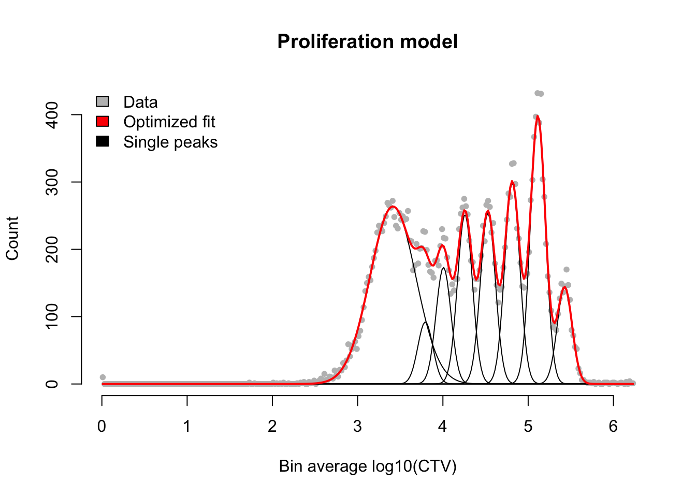

```r
get_prolif_stats(fit.a[1:7,])
#> founding_population  divided_population proliferation_index      division_index
#>         5171.056388         3595.194450            3.417046            4.476496
#>     percent_divided     num_generations        total_events       events_peak_x
#>           69.525338            6.000000        17669.735893                  NA

# Fit sample by gating and ignoring bleedover
fit.b <- fit_peaks(trace=sample.b,
                   peak.0.lower.bound=gen0.cutoff,
                   mode="LS",
                   opt.trim.left.tail = T,
                   opt.trim.right.tail = T,
                   peak.max=6,
                   peak.x.model = F,
                   plot.optim=F)
```

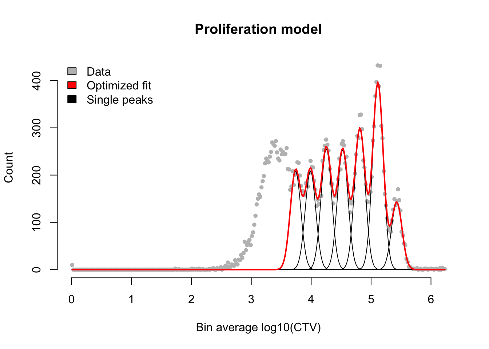

```r
get_prolif_stats(fit.b)
#> founding_population  divided_population proliferation_index      division_index
#>         5232.184656         3654.331203            3.733622            4.913935
#>     percent_divided     num_generations        total_events       events_peak_x
#>           69.843315            6.000000        19535.000000                  NA

cols  <- palette.colors(n = nrow(fit.b), recycle = T)

plot(fit.a[1:7,]$peak_events,
     fit.b$peak_events,
     xlim=c(0,5000),
     ylim=c(0,5000),
     col=cols,
     pch=20,
     cex=2,
     xlab="Number of events in peak - with peak x",
     ylab="Number of events in peak - no peak x")
abline(a=0, b=1, lty=2)
legend("topright",
       legend=paste0("Gen", fit.a[1:7,]$generation),
       fill=cols)
```

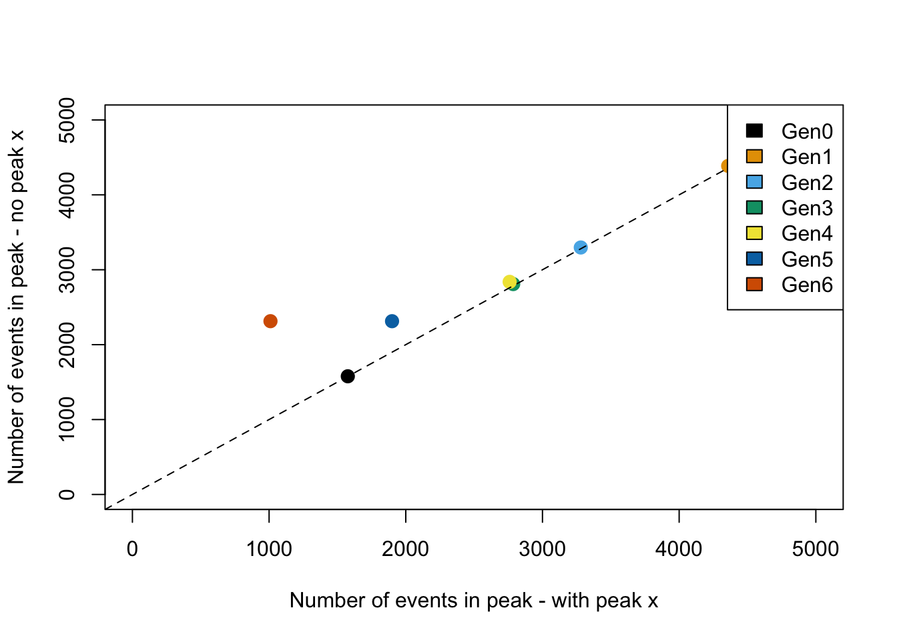

## Evaluate FCS express vs this data
