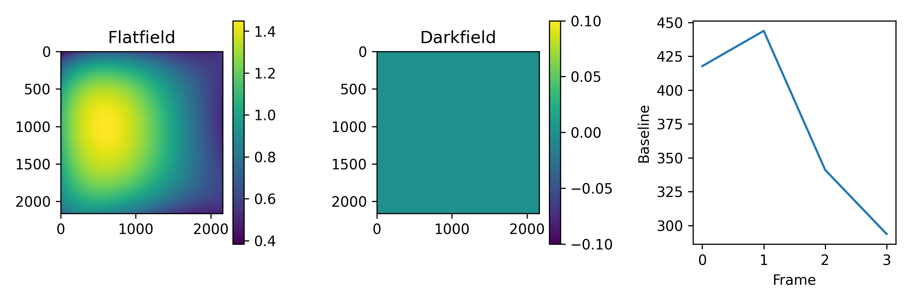
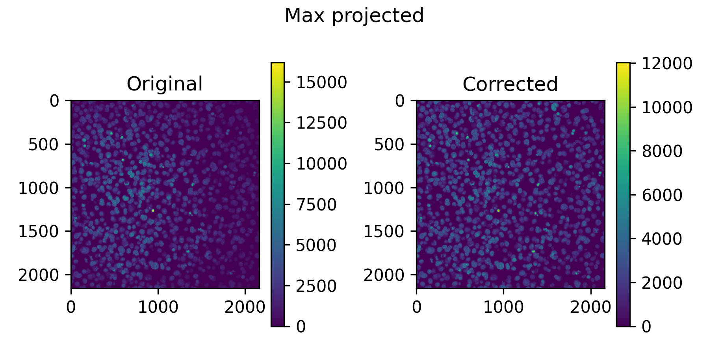
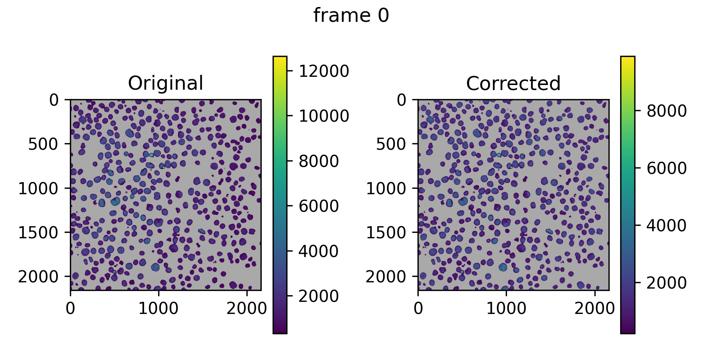
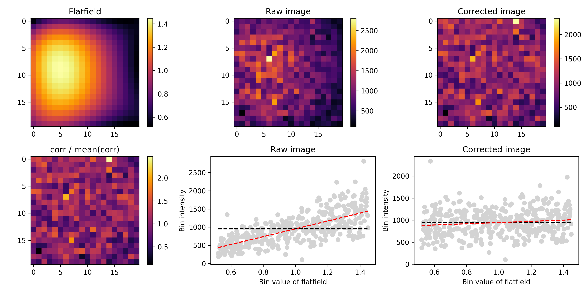
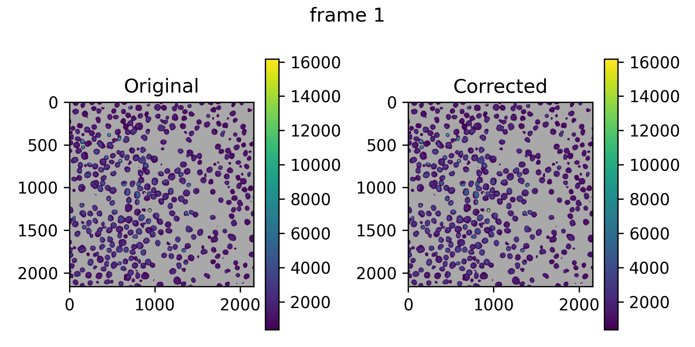
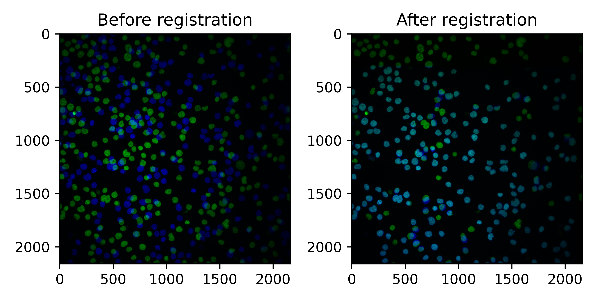
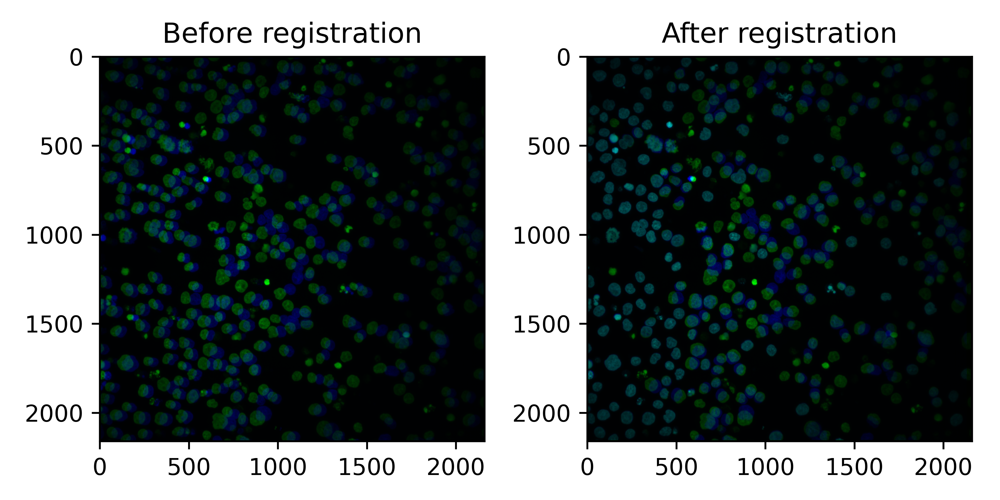
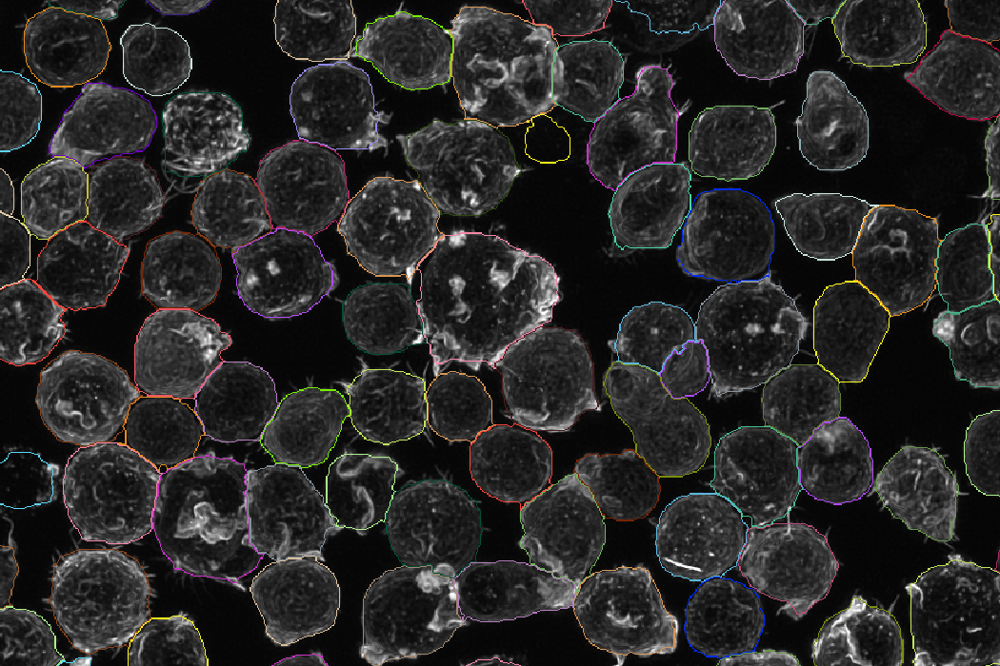
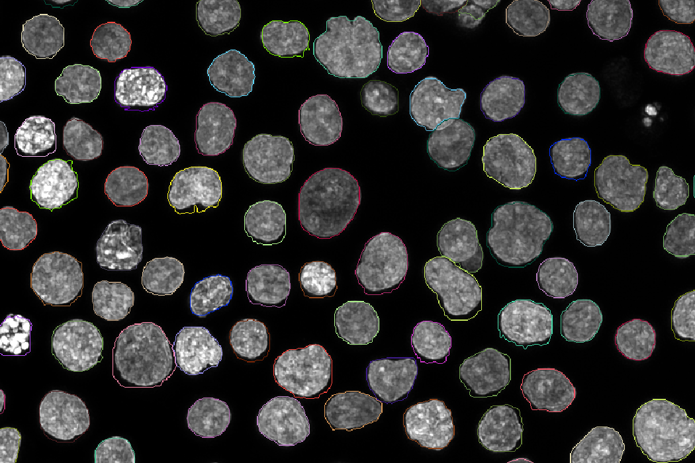

# Understanding output

The following page provides a general guideline for optimizing pipeline settings and understanding the output.
It is not exhaustive or difinitve, and imaging data is very variable, so what worked for us might not work for you.


## Flatfield estimation

### Output
Flatfield estimation produces a folder `<plate>/<plate>_ch<channel>` with a basicpy model that can be loaded with basicpy.
As this is simply a numpy file `profiles.npz` with a json `settings.json`, 
we also use this for saving the polynomial results to keep the code consistent.

The PNG files represent various evaluations to judge the quality of the fits.

- `flat_and_darkfield.png` show the flatfield and darkfield. The darkfield is always 0 in our case.



- `all_imgs_max_proj_pre_post.png` show a single max projection of all of the images that went into training before and after applying the learned flatfield.




- `img<x>_pre_post.png` show the pre post correction for the first 4 training images. Grey pixels represent background not used in training



- `model_evaluation_nimg_<x>_nbin_<x>.png` shows the main flatfield evaluation plot on randomly drawn test images not used in training




- `model_evaluation_<x>_pre_post.png` show the same as the main pre_post files, but on the test images.




### Modes
For flatfield estimation we have 3 options controllable by `bp_mode`:
- POLY: fits a polynomial surface to (typically) foreground pixels and is the default mode. 
- PE: extract flatfields from precomputed plate/extractor (PE) indices when available.
- BASICPY: train `basicpy` models on sampled images or compound max-projections for more flexible model fitting.

#### Mode POLY
Poly fits a polynomial in the form:
```
If it is <= 0 a special case is used where a model is fit in the form:
	# ^1    # ^2             # ^3                        # ^4
1 + x + y + xy + x^2 + y^2 + x^3 + x^2*y + y^2*x + y^3 + x^4 + x^3*y + x^2*y^2 + y^3*x + y^4
```

This is the same approach as takin by Revity in their Harmony software and this is set by default.
By changing the degree using `bp_degree` you can control polynomial complexity. 
You can either fit simpler or more complex polynomials, altough I wouldn't reccomend going above a degree of 4.  

#### Mode PE
Will attempt to extract the foreground flatfield from the Revity/PerkinElmer Index.xml file for the plate specified in the manifest. 
Sometimes Harmony does not produce a flatfield, in which case you may get errors. 
This does interact with global flatfields, in which case the Index.xml from the first plate in the manifest is used.

####  Mode BASICPY
Will use basicpy to fit flatfields. Basicpy is great, but seems to work best with very dense images (like tissue sections). 
For CellPaint or our Tglow data you may have more issues to get reliable fits. See 'Sparsity and foreground selection' below

### What are "global flatfields"
By default, the pipeline fits a flatfield per channel and plate, however you may whish to have one flatfield per channel which is consistent over all plates, to avoid a potential source of bias between plates in your data. This is enabled by the global flatfield option, which will use images from all plates to fit one flatfield for the dataset. When multi-cyclic data is provided, a global flatfield is produced per cycle. This is done as different cycles may have different base intensities which could shift the flatfield somewhat, especially for lower intensty signals.

> Note: Due to pipeline structure, we have to parent these flatfields under a plate. So we opt to plave them under the first plate in the manifest wiht the prefix 'global_flatfield'. Eventough they are under the first plate, images from all plates have been used to train them. To stage the flatfields, we symlink each plate/channel to this global plate/channel folder.  

### Sparsity and foreground selection
For fitting polynomials, depending on how strong the flatfield is, you might need lots of images to get good results. By default, we fit the polynomial on the foreground signal (defined by Otsu / 3) as we have datasets with lots of sparsity, and the forground flatfield and background flatfields are not the same. However for very sparse images, this can give issues as the threshold gets set too high. In these cases we can combine multiple images by max projection to artifcally increase the density of foreground signal, which aleviates the problem and can help to produce more stable flatfields. 

In the example images, the pixels selected as background are set to gray, so you can see what actually feeds into the models.

### Overriding flatfields
In some cases, it may be very hard to produce a proper flatfield, but if you are confident you have a better fit using some other data, you can simply copy that other flatfield under the folder for the plate you want to override and the pipeline will work with the flatfields you replaced it with. If you geneated then outside the pipeline, make sure to save it as a basicpy object (profiles.npz and settings.json). You can just create dummy files for the pngs using 'touch flat_and_darkfield.png' for instance and the pipeline shouldn't re-run anything.


## Deconvolution

The devonvolution output produces the same structure as the images folder, but each image stack represents the deconvoluted images.
As deconvolution is done in 32 bit floats, but we want to store 16bit uint to keep it scalable, to avoid clipping, we clip the max 
to a constant and then scale the 32 bit into 16bit uint. This max value  defaults to 327675 (5*65535) and is set by `dc_clip_max`.
The value of 327675 should be safe to prevent serious clipping in most cases, but make your own evaluations.

There is a little loss of dynamic range in lower values as a result. You can optimize or disable this behaviour by
setting `dc_clip_max=65535` to keep dynamic range, but have a risk of clipping if your input images were close to the 
max intensity to begin with. 


## Segmentation

Masks are stored as regular 16 bit uint tiff files organized in the same plate/row/col/field structure as images and decon.
The folder will contain `_cell_masks` for the cells and if enabled `_nucl_masks` for the nucelei. 
If the `rn_hybrid=true` or `rn_max_project=false`  the masks will be in 3d. If not, they will be in 2d,
but saved as ZYX stacks regardless.

You will only get segmentation results for the reference plates, not the subsquent cycles. At the moment, you can only segment
on stains in cycle one.

The main parameters to control Cellpose are `cp_cell_size`, `cp_nucl_size`, `cp_cell_prob_threshold` and `cp_nucl_prob_threshold`. 
Please see the cellpose documentation for a detaild explanation what these mean.

If you still find many false positives or negatives after tweaking those, you may want to fix `cp_min_cell_area` and `cp_min_nucl_area`
as well. By default these are scaled based on the cell and nucleus sizes but this may fail if you have very different cell sizes
in your images. 

Segmentation in 3d can be slow, so to speed this process up, we have an option that runs CellPose on a downsampled version.
To downsample set `cp_downsample=2` which will downsample by 2x. I would reccomend a whole number, and not to go higher then 2
unless you have very high resolution images and not very complicated cells. This approach works well if your cells are quite round.
For more complex settings, the full resolution may be more appropriate. The masks are scaled up again to the full resolution
prior to saving.

If you want to treat your cycles as completely seperate that is possible, you can either do multipke pipeline
runs or omit the registration manifest, in which case they will be treated as seperate plates. However this may have impacts on
flatfield estimation and your cellprofiler pipeline, so in general I would reccomend doing seperate runs with dedicated features
for the extra cycles if you want to do this. 

 
## Registration

Registration results are stored as a pickle file per field and organized into the plate/row/col/field structure. 
The pickle file will contain the registration matrix with the translation to apply to get the multiple cycles aligned.
A  PNG per field & cycle is produced to evaluate the registration, and a per-well file called `registration_eval.tsv` with summary statistics is produced

The reference plate is highlighted in green, the subsquent cycle in blue.

In the following example, registration worked well, with some cell loss (only green cells) mut the majority of cells aligning well.
It is important to use the correlation between the nuclei stains as a QC metric to remove cells which did not register well.




In the next example, the registration still worked well, but in this field there are more cells that have shifted during the
second cycle. These will need to be removed in downstream QC, but the ones that registered well can still be used.





## Processed images

These are plate/row/col/field ome tiffs which have all cycles combined, deconvoluted, flatfields applied and any max projection done
if `rn_hybrid=true` or `rn_max_project=true`. They also contain the masks. These folders can be easily visualised in Napri to check for
any issues with deconvolution or segmentation.

Example cell masks
 


Example nucleus masks



> Note: In case `rn_hybrid=true` a max projection of the 3d masks is done to get them into 2d. In some cases you may get nicer masks by fitting on the max projections directly, but at the moment the pipeline does not re-fit masks after max projection in hybrid mode 


## Cellcrops

These are  plate/row/col/field hdf5 files where each h5 group is a single cell. They are constructed based on the processed images
and have the masks appeneded as the last channels. There is also a CSV file for each field that contains the metadata for each cell
(index in the h5, position in xyz, max intensities, registration correlation etc).

Once all cellcrops have been generated, a main `cellcrop_index.csv.gz` is created which concatenates all these files so it is easy
to read and index them in the tglow-r package or when sampling for training dl models.

> Note: In future versions we may change this to have one h5 per well instead to reduce indexing overheads.

## Features
Produces plate/row/col/plate_well.zip archives with the CellProfiler output. Every sub obeject (nucleus, cytoplasm) should be
exported as a seperate tsv file when setting up the pipeline for compatibility with the tglow-r package. Tglow-r reads these
zip archives directly and automatically matches any sub-objects and calculates the means. Alternatively, you can do this already
in cellprofiler and just export the main cell object and the means as one file.

To disable the zipping set `cpr_no_zip=true` and you will get the full unzipped cellprofiler output.
The zipping helps to reduce file numbers and sizes and makes it easier to manage the files, so I would reccomend keeping it enabled.
