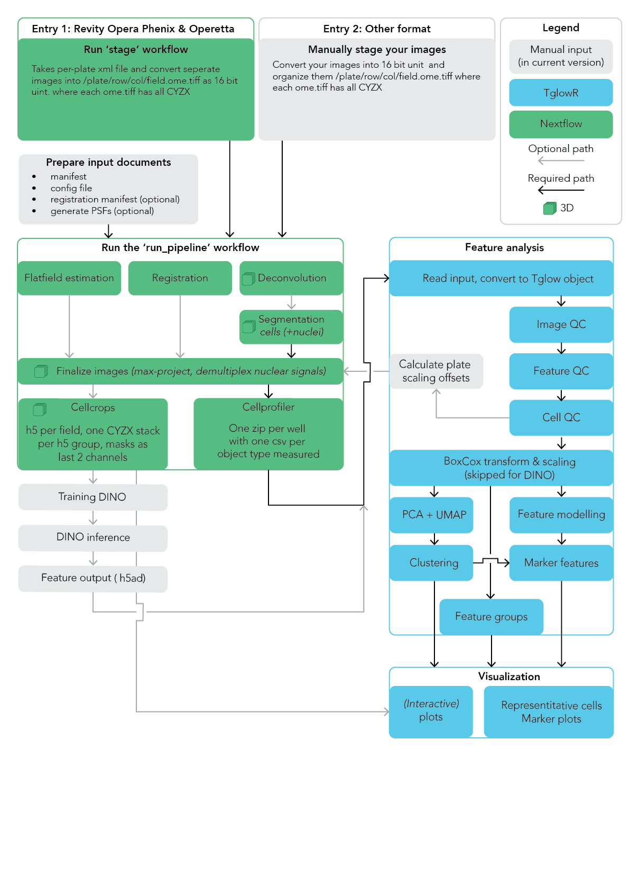

# Introduction

`tglow-pipeline` is a Nextflow pipeline for processing high-content imaging (HCI)
plates, from raw Revity/PerkinElmer (Opera Phenix, Operetta) exports to
single-cell features. It handles flatfield correction, multi-cycle registration,
deconvolution, Cellpose segmentation, intensity scaling, CellProfiler feature
extraction, cell crops and an HTML QC report.

> Check out our preprint: [bioRxiv 2026.02.10.704860](https://www.biorxiv.org/content/10.64898/2026.02.10.704860v1)

The pipeline is one of three components:

1. [tglow-pipeline](https://github.com/TrynkaLab/tglow-pipeline): the Nextflow workflows and Python scripts documented here.
2. [tglow-core](https://trynkalab.github.io/software/tglow-core/): Python library with the image I/O, parsing and helper functions the pipeline uses.
3. [tglow-r](https://trynkalab.github.io/software/tglow-r/): Seurat-like R package for analysing the features the pipeline produces.

## Guide

1. [Installation](installation.md)
2. [Manifests and configuration](manifests-and-configuration.md)
3. [Staging data](staging-data.md)
4. [Running the pipeline](running.md)
5. [Scaling](scaling.md)
6. [QC report](qc-report.md)
7. [Understanding output](understanding-output.md)
8. [Analysing features in R](analyzing-features-in-r.md)

Reference: [Parameters](parameters.md) · [FAQ](faq.md) · [Known issues](known-issues.md) · [Changelog](changelog.md)

> Upgrading from v0.0.1-beta? Channel numbers are now 0-indexed everywhere, many
> parameters were renamed and the pipeline now rejects unknown parameters. Read the
> [migration notes](manifests-and-configuration.md#migrating-from-v001-beta) before re-running an existing project.

## Pipeline overview

The pipeline has two workflows, selected with `--workflow`:

- **`stage`** converts a Revity/PerkinElmer export into one OME-TIFF per field,
  organised as `<plate>/<row>/<col>/<field>.ome.tiff`, and records the plate
  metadata. You can skip it if you organise your images in this layout yourself.
- **`run_pipeline`** processes the staged images. Most steps are optional and
  switched on or off through parameters or the manifest.

> This diagram predates v0.2.0. Plate scaling offsets are now calculated inside
> the pipeline (see [Scaling](scaling.md)) rather than in R, and the QC report
> is not shown.

The main steps of `run_pipeline`, in the order they typically run:

| Step | Parallelised per | Notes |
|---|---|---|
| Flatfield estimation | plate and channel, or cycle and channel for global flatfields | Optional. Polynomial (default), BaSiCPy or Harmony (PE) flatfields. |
| Deconvolution (clij2-fft Richardson-Lucy) | well | Optional. Requires a GPU. |
| Registration | well | Optional. Aligns the cycles of a multi-cycle experiment. |
| Segmentation (Cellpose) | well | GPU recommended. Runs on the reference (first cycle) plates, using the deconvolved images when deconvolution is enabled. |
| Finalize | well | Applies flatfields and registration, merges cycles, max projects and demultiplexes nuclear/cytoplasmic signal. |
| Intensity measurements | well | Per-cell and per-image intensity features, used for scaling and QC. |
| Scaling | run | Optional. Puts channels on a comparable intensity scale across plates. See [Scaling](scaling.md). |
| CellProfiler | well | Feature extraction with your own CellProfiler pipeline. |
| Cell crops | well | Optional. One HDF5 file per field with a crop of every cell. |
| QC report | run | A self-contained HTML report plus a per-well QC table. See [QC report](qc-report.md). |

## Design notes

- **Two kinds of output folders.** The expensive, early steps (images,
  flatfields, registration, masks, deconvolution) use Nextflow `storeDir` as a
  permanent cache: if the output exists it is reused, even if parameters changed.
  Delete or rename these folders to force a re-run. Everything downstream of
  finalize is published to folders prefixed `rr__` and re-runs automatically when
  its inputs change. See [Re-running and caching](running.md#re-running-and-caching).
- **Parallelisation is per well**, to avoid many short jobs with high overhead
  (environment activation, Python start-up).
- **Field-aware.** The pipeline handles fields that are missing in some cycles or plates.
- **No stitching.** If you need stitched images, stitch before running the
  pipeline and disable flatfield estimation, which does not work on stitched images.
- **HPC first.** The pipeline is built for HPC clusters. Segmentation and
  deconvolution need GPUs for realistic data sizes. For small tests you can run
  locally with `-profile local`.
