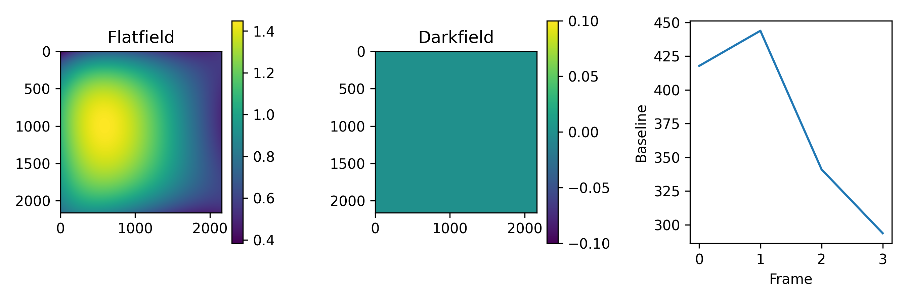
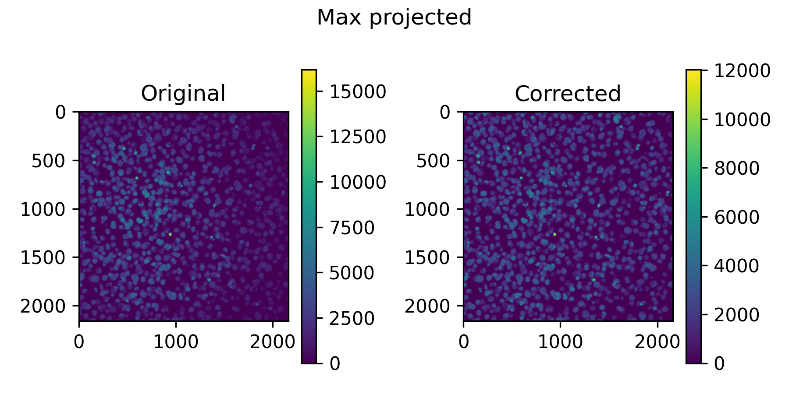
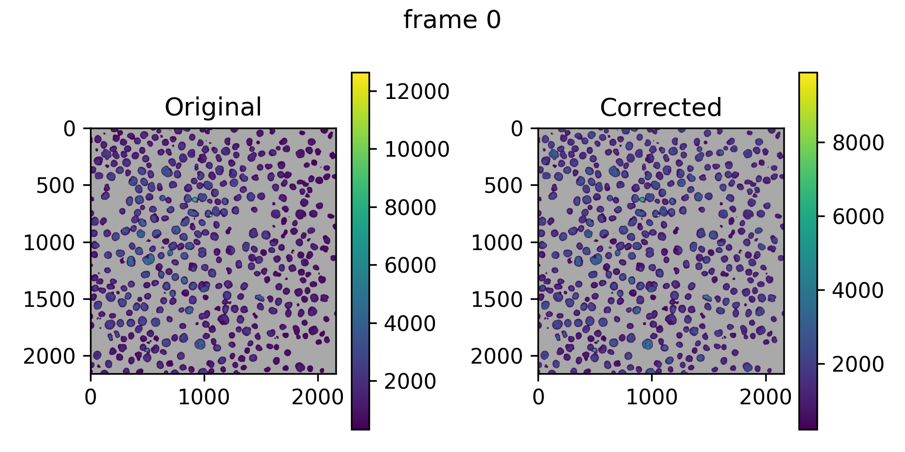
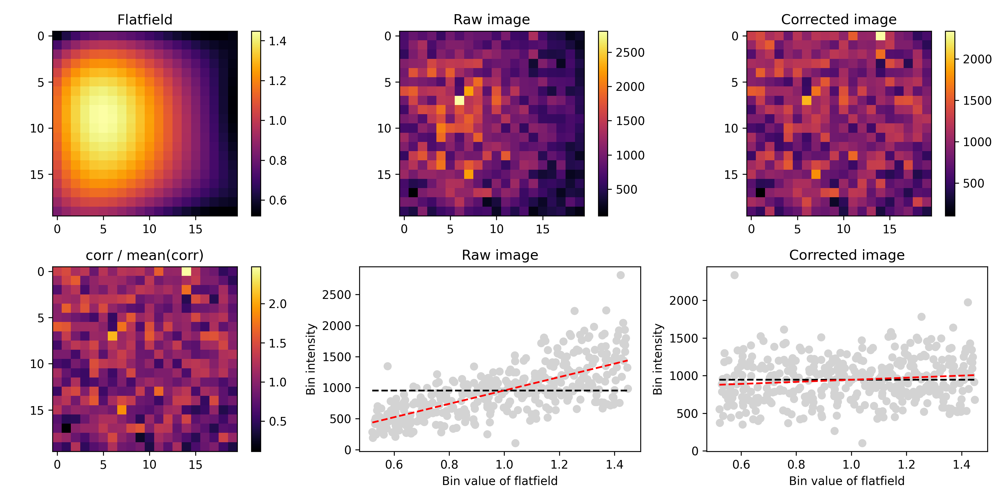
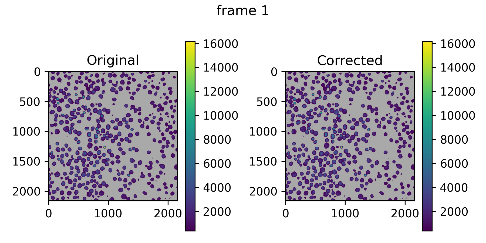
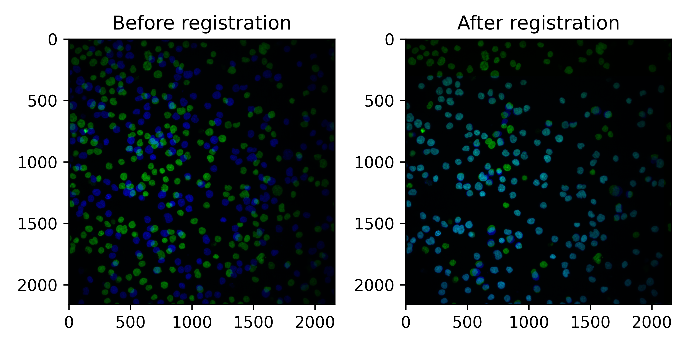
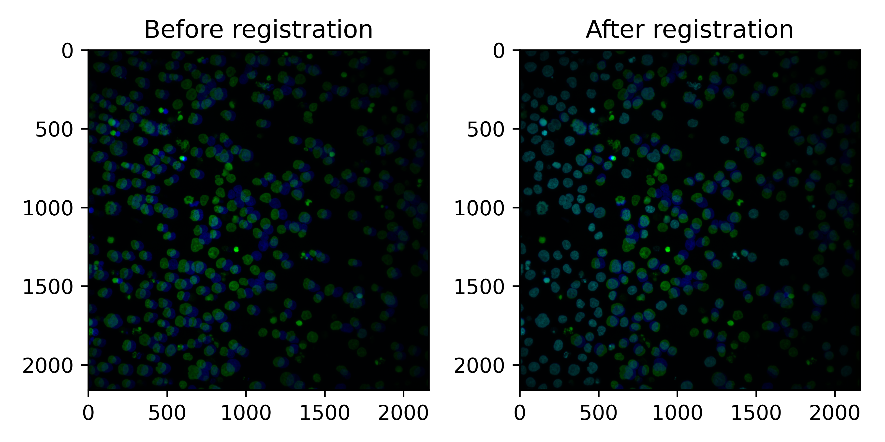
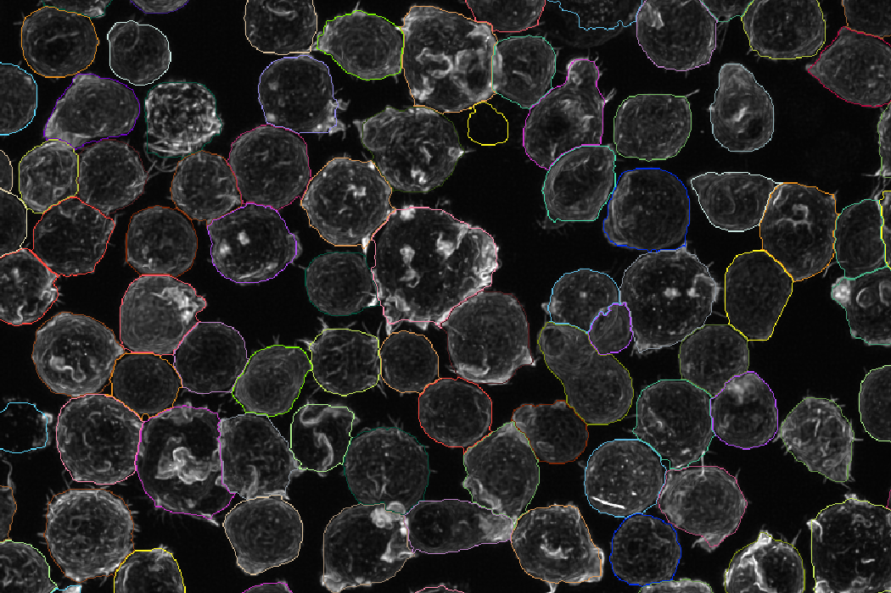
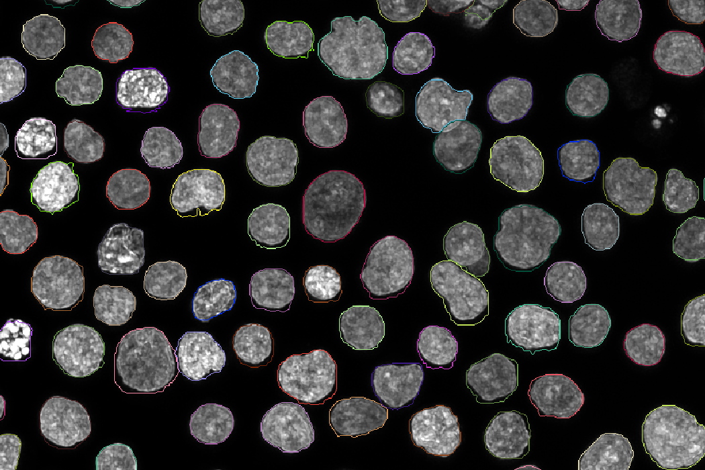

# Understanding output

This page describes the output of each step and gives guidelines for
tuning the settings. It is not exhaustive or definitive: imaging data varies
a lot, so what worked for us might not work for you.

## Output layout

A typical `run_pipeline` run produces the following in `rn_publish_dir`
(default `../results`), next to the staged images (`rn_image_dir`) and
deconvolved images (`rn_decon_dir`):

```text
results/
├── images/                  # Staged images (rn_image_dir)
├── decon/                   # Deconvolved images (rn_decon_dir, dc_run)
├── flatfields/              # Flatfield models and evaluation plots
├── registration/            # Registration transforms and plots
├── masks/                   # Cellpose masks
├── rr__processed_images/    # Final images: unscaled/, scaled/, masks/
├── rr__features/            # measurements/ and cellprofiler/
├── rr__scaling/             # Scaling factors, see Scaling
├── rr__cellcrops/           # Single-cell crops
└── rr__qc/                  # QC report and per-well QC table
```

The folders without a prefix are a permanent cache; the `rr__` folders are
re-run by Nextflow when their inputs change and contain symbolic links into
the work directory. See [Re-running and caching](running.md#re-running-and-caching).

Images, masks and most other per-field outputs follow the
`<plate>/<row>/<col>/` structure of the staged images. Channel numbers in
all outputs are 0-indexed.

## Flatfield estimation

### Output

For every plate and channel, flatfield estimation writes a folder
`flatfields/<plate>/<plate>_ch<channel>/` with:

- `profiles.npz` and `settings.json`: the model, in the format used by BaSiCPy.
  The polynomial and PE modes use the same format, to keep the code consistent.
- PNG files to judge the quality of the fit, described below.

`flat_and_darkfield.png` shows the flatfield and the darkfield. The darkfield
is not fitted and is always 0.



`all_imgs_max_proj_pre_post.png` shows a max projection of all training
images, before and after applying the flatfield.



`img<x>_pre_post.png` shows the correction on the first training images.
Grey pixels are background that was not used for training.



`model_evaluation_nimg_<n>_nbin_<x>.png` is the main evaluation plot, on
randomly drawn test images that were not used for training (`ff_nimg_test`).



`model_evaluation_pre_post_nimg_<n>_nbin_<x>.png` shows the same as the
`pre_post` plots, but on the test images. With `ff_threshold = true` there
are also `model_evaluation_thresh_<x>_...` plots on the thresholded images.



The flatfields also appear in the [QC report](qc-report.md#tab-3-flatfields).

### Modes

`ff_mode` selects how flatfields are estimated:

- **`POLY`** (default): fits a polynomial surface to the images.
- **`PE`**: takes the flatfield that Harmony calculated from the plate's
  Revity/PerkinElmer index file.
- **`BASICPY`**: fits [BaSiCPy](https://basicpy.readthedocs.io/) models on sampled images.

#### POLY

With `ff_degree` 0 or below (the default), the polynomial has this form,
which is the same approach Revity uses in Harmony:

```text
1 + x + y + xy + x^2 + y^2 + x^3 + x^2*y + y^2*x + y^3 + x^4 + x^3*y + x^2*y^2 + y^3*x + y^4
```

Set `ff_degree` to fit a simpler or more complex full polynomial of that
degree. We recommend a degree between 2 and 4. `ff_use_ridge = true` fits
with cross-validated ridge regression instead of ordinary least squares.

#### PE

Extracts the foreground flatfield from the Revity/PerkinElmer index file
given in the manifest. Harmony doesn't always produce a flatfield, in which
case this mode fails. With global flatfields, the index file of the first
plate in the manifest is used.

#### BASICPY

BaSiCPy is great, but seems to work best with very dense images, such as
tissue sections. For Cell Painting or our tglow data it is harder to get
reliable fits. See [Sparsity and foreground selection](#sparsity-and-foreground-selection) below.

### Global flatfields

By default, a flatfield is fitted per plate and channel. With
`ff_global_flatfield = true`, one flatfield per channel is fitted on images
from all plates, which avoids a potential source of bias between plates. For
multi-cycle data, a global flatfield is fitted per cycle, because cycles can
have different base intensities that shift the flatfield, especially for dim
signals.

Global flatfields are fitted for the `ff_channels` of the first plate in the
manifest. Channels that other
plates list in `ff_channels` but the first plate doesn't get no flatfield.

Because of the pipeline structure, global flatfields are stored under the
reference plate as `global_refplate_<plate>_ch<channel>`, and copied to the
folder of every plate. Even though they sit under one plate, they are
trained on images from all plates.

### Sparsity and foreground selection

Depending on how strong the flatfield is, you may need many images for a
good fit (`ff_nimg`, default 200). In sparse images, the background can
dominate the fit, while the flatfield of the foreground signal is what
matters. Options:

- `ff_threshold = true` fits only on the foreground: the images are
  thresholded (multi-Otsu) and the two brightest tiers are used.
- `ff_merge_n` combines several images into one by max projection, to
  artificially increase the density of foreground signal. This can give
  more stable flatfields for very sparse images. `ff_pseudoreplicates` does
  something similar in memory, without reading more images.

In the example images, the pixels not used for fitting are grey, so you can
see what goes into the model.

### Overriding flatfields

If a proper flatfield is hard to fit, but you have a better one from other
data, copy it into the folder of the plate and channel you want to override.
Because `flatfields/` is a permanent cache, the pipeline will use your file.
If you made it outside the pipeline, save it in the same format
(`profiles.npz` and `settings.json`). You can create dummy files for the PNGs,
for example with `touch flat_and_darkfield.png`, so the pipeline doesn't try
to re-run anything.

## Deconvolution

Deconvolution (`dc_run = true`) writes the same `<plate>/<row>/<col>/<field>.ome.tiff`
structure as the staged images to `rn_decon_dir`, with the deconvolved images.
Channels without a PSF in the manifest's `dc_psfs` are not deconvolved, but
go through the same 16-bit conversion described below. In
2D mode (`rn_max_project = true` without `rn_hybrid`), the deconvolved
images are saved as max projections.

Deconvolution is done in 32-bit floats, but the images are stored as 16-bit
integers to save space. To avoid clipping, the intensities of all channels are
divided by `dc_clip_max` and multiplied by 65535. The default `dc_clip_max` of 327675
(5 × 65535) should prevent serious clipping in most cases, but make your own
evaluation. It does lose some dynamic range at low intensities. You can set
`dc_clip_max = 65535` to keep the full dynamic range, at the risk of clipping
if the input images were already close to the maximum intensity.

Compare before and after images in the [QC report](qc-report.md#tab-4-deconvolution).

## Segmentation

Masks are stored as 16-bit TIFF files in `masks/<plate>/<row>/<col>/`, one
per field for the cells and, if a nucleus channel is set, one for the nuclei:

```text
<field>_cell_mask_d<cp_cell_size>_ch<channel>_cp_masks.tiff
<field>_nucl_mask_d<cp_nucl_size>_ch<channel>_cp_masks.tiff
```

In 3D and hybrid mode the masks are 3D. In 2D mode they are 2D, but saved
as ZYX stacks regardless.

Only the reference plates are segmented, not later cycles, so you can only
segment on stains in the first cycle. With deconvolution enabled,
segmentation runs on the deconvolved images.

The main Cellpose settings are `cp_cell_size`, `cp_nucl_size` (the
expected diameters in pixels), `cp_cell_prob_threshold`,
`cp_nucl_prob_threshold`, `cp_cell_flow_thresh` and `cp_nucl_flow_thresh`.
See the [Cellpose documentation](https://cellpose.readthedocs.io/) for what
they mean. In rough order of importance:

1. Make sure the cell and nucleus sizes are right.
2. Tune the probability thresholds (between -6 and 6; higher gives tighter masks).
3. Tune the flow thresholds.
4. If you still get many false positives or negatives, set `cp_min_cell_area`
   and `cp_min_nucl_area`. By default these are derived from the cell and
   nucleus sizes, which may not work if cell sizes vary a lot.

3D segmentation can be slow. `cp_downsample = 2` runs Cellpose on images
downsampled 2 times in X and Y, and scales the masks back up to full
resolution before saving. The sizes and minimum areas are adjusted
automatically, so set them in terms of the original image. We recommend a
whole number, and not going above 2 unless you have very high resolution
images and simple, round cells. For complex shapes, full resolution may be
better.

To evaluate the segmentation, inspect the processed images and masks in an
image viewer such as Napari, or compare with a manually annotated gold
standard. The pipeline has no built-in segmentation validation.

If you want to treat your cycles as separate plates, omit the registration
manifest. This affects flatfield estimation and your CellProfiler pipeline,
so in general we recommend separate runs with dedicated features for the
extra cycles instead.

## Registration

Registration results are stored per field in
`registration/<reference plate>/<row>/<col>/`:

- `<field>.pickle`: the translation that aligns each query cycle to the reference.
- `<field>_<query plate>_refch<R>_qrych<Q>.png`: a plot to evaluate the registration (`rg_plot = true`).
- `registration_eval.tsv`: per well, the correlation between the
  registration channels before and after registration (`rg_eval = true`).

In the plots, the reference plate is green and the query cycle blue.

In the following example, registration worked well: some cells were lost
(only green) but most cells align well.



In the next example, registration still worked, but more cells moved during
the second cycle. These cells need to be removed downstream, but the ones that
registered well can still be used.



Because individual cells can move between cycles, the pipeline also
measures the correlation of the nucleus stains within each cell
(`ch<ref>_ch<query>__registration_corr` in the measurements, one column per
query cycle). Cells below
`sc_registration_thresh` are excluded from scaling, and the QC report shows
the worst and best aligning fields (see [QC report](qc-report.md#tab-2-registration)).
Use the same correlation to filter cells in downstream analysis.

## Processed images

Finalize combines everything into analysis-ready images in
`rr__processed_images/`: the cycles merged, deconvolution and flatfields
applied, registered, max projected (in 2D and hybrid mode), and
demultiplexed into nuclear and non-nuclear channels for `mask_channels`.

| Folder | Contents |
|---|---|
| `unscaled/<plate>/<row>/<col>/<field>.ome.tiff` | Before scaling. Published unless `sc_publish_unscaled = false`. |
| `scaled/<plate>/<row>/<col>/<field>.ome.tiff` | After [scaling](scaling.md), when scaling is enabled. |
| `masks/<plate>/<row>/<col>/` | The masks that belong to the processed images (max projected in hybrid mode). |

Each image folder has a `manifest.tsv` per plate. `unscaled/<plate>/channel_indices.tsv`
describes the final channels. It is published even when the unscaled images
are not (`sc_publish_unscaled = false`):

| Column | Meaning |
|---|---|
| `ref_plate`, `plate`, `cycle` | Where the channel comes from. |
| `channel`, `name` | The final (merged) channel number and name. |
| `orig_channel`, `orig_name` | The channel number and name on its own plate. |

Mask channels are appended at the end, named `... mask inclusive` and
`... mask exclusive`. See [Final channel numbers](manifests-and-configuration.md#final-channel-numbers).

The processed images are easy to view in Napari, to check deconvolution and
segmentation.

Example cell masks:



Example nucleus masks:



> In hybrid mode, the 3D masks are max projected to get them into 2D. In some
> cases you may get nicer masks by segmenting the max projections directly,
> but the pipeline currently does not re-segment after max projection.

## Intensity measurements

With `rn_cache_images = true`, the pipeline measures every cell and image in
the processed images. The measurements are used for [scaling](scaling.md) and
the [QC report](qc-report.md), and are useful for your own QC. They are
written per well to
`rr__features/measurements/<unscaled or scaled>/<plate>/<row>/<col>/`:

- `object_features.parquet`: one row per cell, with columns `ch<N>__<stat>`
  (`min`, `q25`, `median`, `q75`, `mean`, `max`, ...) for every final channel,
  measured in the cell or nucleus mask as set by the
  [channel map](manifests-and-configuration.md#channel-map). For multi-cycle
  runs it also has the registration correlation of each cell.
- `image_features.parquet`: one row per field, with background statistics
  (the pixels outside cells), thresholds, debris metrics and their
  debris-removed (`_dbrm`) variants.

## Features

CellProfiler runs your own pipeline (`cpr_pipeline_2d` in 2D and hybrid mode,
`cpr_pipeline_3d` in 3D mode) on each well. The images are staged for
CellProfiler as one TIFF per field and channel:

```text
<field>_<plate>_<well>_ch<channel>.tiff
```

where `<plate>` is the reference plate, `<well>` is written like `A01`, and
`<channel>` is the final, 0-indexed channel number. The masks are in the same
folder, with the names from [Segmentation](#segmentation). Set up the
NamesAndTypes module of your CellProfiler pipeline to match this pattern. For
the per-plate aggregation, name the main object `cell` and export every
object as a separate file.

Output, in `rr__features/cellprofiler/`:

| File | Contents |
|---|---|
| `<plate>_cells.parquet` | One row per cell for the whole plate, with the features of sub-objects (such as nuclei) merged onto their parent cell. |
| `<plate>_image.parquet` | One row per image for the whole plate. |
| `features/<plate>/<row>/<col>/<plate>_<well>.zip` | The raw CellProfiler output per well. Only published with `cpr_publish_features_per_well = true`. |

The aggregation (`cpr_run_concat = true`) reads the `*_cell.txt` and
`*_Image.txt` files of each well. Every other file matching
`cpr_child_pattern` is treated as a sub-object and merged onto its parent
cell using the `cpr_parent_col` column (default `Parent_cell`, written by
CellProfiler's RelateObjects module). When a cell has several sub-objects,
their values are combined with `cpr_merge_strategy` (`mean`, `median` or
`sum`). Columns get a prefix per object (for example `cell_`), and every row
gets `plate`, `well` and global cell and image ids.

The aggregation needs the zipped output; with `cpr_no_zip = true`, you get the
full unzipped CellProfiler output instead and no aggregation.

## Cell crops

With `rn_make_cellcrops = true`, the pipeline cuts every cell out of the
processed images (the scaled images when scaling is enabled). In
`rr__cellcrops/<plate>/<row>/<col>/`:

- `<field>.h5`: an HDF5 file per field, with one group per cell. The masks
  are appended as the last channels.
- `<well>.parquet`: metadata for every cell of the well: its index in the
  HDF5 file, position, intensities, registration correlation and so on.

`rr__cellcrops/cellcrop_index.parquet` combines the metadata of all wells,
so you can easily index the crops from tglow-r or when sampling cells to
train deep learning models. Fields with more than `rn_max_per_field` (default
1000) cells are skipped.

## QC report

See [QC report](qc-report.md).
